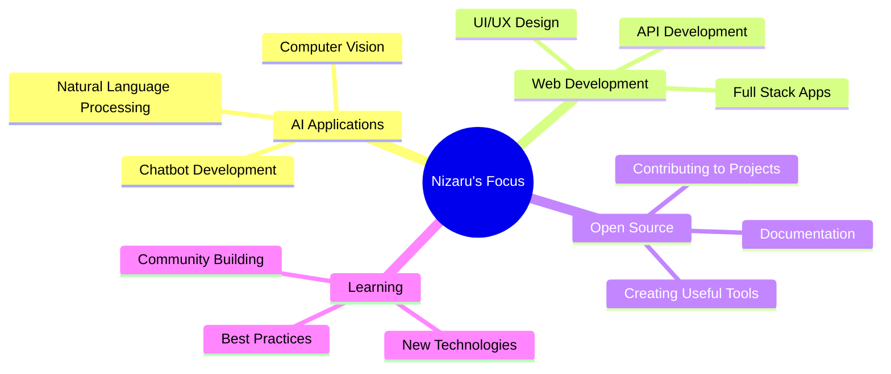

# Hi there, I'm Nizaru 👋

<div align="center">
  


</div>

## 🚀 About Me

```python
class Nizaru:
    def __init__(self):
        self.name = "Nizaru"
        self.role = "AI Developer & Tech Enthusiast"
        self.location = "Indonesia 🇮🇩"
        self.languages = ["Python", "JavaScript", "TypeScript", "Go"]
        self.interests = ["AI/ML", "Web Development", "Open Source", "Automation"]
        self.current_focus = "Building AI-powered applications"
        
    def say_hi(self):
        print("Thanks for dropping by! Let's build something amazing together 🚀")

me = Nizaru()
me.say_hi()
```

## 🛠️ Tech Stack

<div align="center">

### Languages & Frameworks


### AI & Machine Learning


### Tools & Platforms


</div>

## 📊 GitHub Stats

<div align="center">
  
  
</div>

<div align="center">
  
</div>

## 🎯 Current Projects

<div align="center">



</div>

## 🏆 Achievements

<div align="center">
  
</div>

## 📈 Contribution Graph

<div align="center">
  
</div>

## 🤝 Let's Connect!

<div align="center">

[](https://linkedin.com/in/nizaru)
[](https://twitter.com/nizaru_gpt)
[](https://instagram.com/nizaru.dev)
[](mailto:nizaru.dev@gmail.com)

</div>

## 💡 Random Dev Quote

<div align="center">
  
</div>

---

<div align="center">
  
### 🌟 "Code is like humor. When you have to explain it, it's bad." - Cory House

**Thanks for visiting! Feel free to explore my repositories and don't forget to star ⭐ if you find something interesting!**


</div>

<!--
**Nizaru-gpt/Nizaru-gpt** is a ✨ _special_ ✨ repository because its `README.md` (this file) appears on your GitHub profile.
-->
